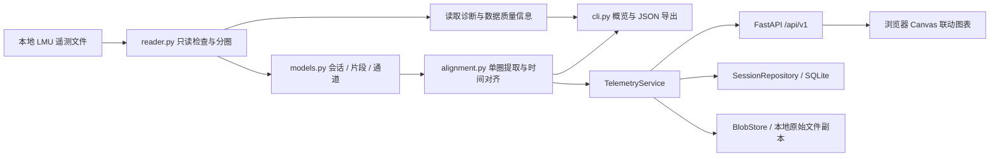

# 模块与数据流

状态：读取、命令行、本地网页及持久化已实现。云端账号和同步未实现。

## 职责

| 模块 | 负责 | 边界 |
| --- | --- | --- |
| `src/lmu_data_analysis/reader.py` | 文件识别、结构检查、原始表读取、分圈、时钟映射 | 不绘图，不修改文件，不推断驾驶表现 |
| `src/lmu_data_analysis/models.py` | Recording、Segment、Series、Diagnostic | 不依赖图表框架 |
| `src/lmu_data_analysis/alignment.py` | 提取完整圈、时间域连续量插值及事件保持 | 保留原始数值，标注插值和缺失，不跨圈补值 |
| `src/lmu_data_analysis/cli.py` | 摘要、选圈参数、JSON 导出 | 独立命令行入口 |
| `src/lmu_data_analysis/web_service.py` | 导入去重、按归属提取圈轨迹、两条录制缓存 | 不依赖 HTTP 或具体存储 |
| `src/lmu_data_analysis/storage.py` | 存储接口及 SQLite / 本地文件实现 | 元数据与原始文件分开存储 |
| `src/lmu_data_analysis/web_app.py` | HTTP 路由、身份注入、本地访问边界 | 当前身份仅限单一本地车手 |
| `web/` | JavaScript 模块、Canvas 曲线与响应式界面 | 仅通过相对路径 API 取数据 |
| `tests/` | 解析正确性、数据边界与必要的交互验证 | 使用合成或授权且去标识化的样本 |

## 数据处理原则

1. 有时间戳的事件保留原始时间戳；没有时间戳的连续表保留采样序号和声明频率，验证后单独建立时间映射，不假定所有通道同频。
2. 读取层保留源字段名和源单位，处理层记录转换关系。
3. 圈内时间与整个会话的时间分开保存，防止跨圈拼接。
4. 图表采样、平滑或插值不得覆盖原始数据；发生时在界面说明。
5. 缺失区间不强行连线；挡位等离散信号按阶梯方式显示。
6. 两圈距离对齐使用可信赛道距离；不把车辆轨迹累计长度直接视为共同赛道坐标。
7. 没有足够信息的字段保持未知；不凭表名或字段名猜测单位。

## 技术选择及持久化

- Python 3.12 + DuckDB 1.5.5；FastAPI 0.141.1 + Uvicorn 0.53.0，前端原生 JavaScript / Canvas，无 CDN 或 Node 构建要求。
- `drivers → sessions → laps` 使用稳定 UUID、外键和事务；`(driver_id, sha256)` 唯一约束实现车手内去重，SQLite schema 版本为 1。
- 原始文件副本以独立随机键保存，文件名仅用于显示。高频曲线按需计算，不逐点写入目录数据库。元数据白名单排除源个人标识。
- 上传暂存后验证，再提交文件与目录；验证失败清理临时文件，数据库写入失败清理新副本。进程崩溃仍可能留下孤立文件，云端需恢复任务。
- `IdentityProvider` 决定当前车手，所有记录和缓存读取先验证归属。本地固定身份不是用户认证，生产接口不接受浏览器指定车手 ID。
- 实时读取若后续获准，将作为新增数据源适配器接入，不改动展示模型的基本职责。

## HTTP API

| 方法与路径 | 内容 |
| --- | --- |
| `GET /api/v1/health`、`GET /api/v1/me` | 状态及当前车手 |
| `GET /api/v1/sessions` | 当前车手练习摘要 |
| `POST /api/v1/sessions` | 文件原始字节；URL 编码 `X-Filename`、`X-LMU-Client: web`；新记录 201，重复 200 |
| `GET /api/v1/sessions/{id}` | 圈次、单位目录、片段与诊断 |
| `GET /api/v1/sessions/{id}/laps/{lap_id}/trace` | 单圈时间、距离、核心通道及逐点来源 |
| `GET /api/v1/sessions/{id}/timing` | 全部圈次、核对后的三个分段与统计摘要 |
| `GET /api/v1/sessions/{id}/inventory` | 原始连续通道 / 事件的采样数、数值范围与可视化评估 |

缺失值使用 null，挡位保持整数，距离不可靠时禁用距离轴；双圈独立绘制到共同坐标轴，不产生自动驾驶结论。

单圈 trace 新增 `trajectory` 可选结果，由 `trajectory.py` 按原始 GPS 采样频率提取，而非制造 100 Hz 定位精度。经纬度只有在单位、频率、行数 / 行序验证通过且成对采样时使用；投影采用球面局部等距近似，x = R × Δ经度 × cos(原点纬度)，y = R × Δ纬度。同一录制取第一个有效坐标为固定原点，不能按圈重新居中。缺口和跳点设置断线标记，圈界不外推、不强制闭合。坐标异常只禁用地图，不阻碍核心曲线。

前端 `trajectory.js` 实现 Canvas 走线、缩放平移、局部跟随与双向游标。标记只在线段内插值，不跨越断线；地图拾取同样忽略断线。窗口缩放与地图缩放独立，但当前圈、参考圈和距离 / 时间轴跟随原有分析控件。

`timing.py` 从录制文件中的分段事件按需重算，不依赖旧版本目录中是否有分段字段；`inventory.py` 只对目录声明的实际数据表做数值汇总。两者均通过服务层先校验归属，因此旧会话可直接使用，无需变更原有 session / lap ID 或 SQLite schema。

## 未来云端迁移

1. 增加真实账号认证，实现 `IdentityProvider`，从服务端验证的登录身份确定车手。建立本地车手到账号的显式归属迁移，不能把各安装的固定本地身份当作同一人。
2. 实现 PostgreSQL `SessionRepository` 和对象存储 `BlobStore`。后者按需下载临时文件交给现有解析器，原始文件不依赖客户端路径。
3. 建立数据库迁移与批量数据迁移工具，保留练习 / 圈次 UUID、校验和与归属；目前没有自动同步或冲突合并。
4. 解析改用隔离工作进程 / 队列，增加超时、内存限制、上传配额、分页、任务状态、孤立文件清理与恢复。当前单进程锁和 128 MB 上限仅服务本地规模；压缩文件大小不代表内存占用。
5. 部署 HTTPS、真实授权、备份恢复、保留 / 删除策略及权限测试后，再调整本机 Host / Origin 限制。当前服务不能直接暴露到公网。

上述是已预留的替换边界和后续必要工作，不表示云服务已经完成。
