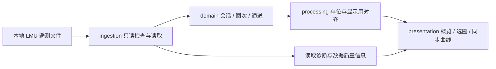

# 模块与数据流

状态：逻辑结构草案；不预设应用框架，也不代表已经存在实现。

## 职责

| 目录 | 负责 | 边界 |
| --- | --- | --- |
| `src/ingestion/` | 文件识别、结构检查、原始表读取、版本适配 | 不绘图，不修改文件，不自行认定驾驶表现 |
| `src/domain/` | 会话、圈次、通道、单位、质量标记的统一模型 | 不依赖图表框架 |
| `src/processing/` | 单位转换、圈次切分、显示所需的时间 / 距离对齐 | 保留原始样本；不输出自动教练结论 |
| `src/presentation/` | 文件选择、圈次列表、图表、游标、提示 | 不直接耦合原始数据库表名 |
| `tests/` | 解析正确性、数据边界与必要的交互验证 | 使用合成或授权且去标识化的样本 |

## 数据处理原则

1. 原始通道保留各自的时间戳，不假定所有通道同频。
2. 读取层保留源字段名和源单位，处理层记录转换关系。
3. 圈内时间与整个会话的时间分开保存，防止跨圈拼接。
4. 图表采样、平滑或插值不得覆盖原始数据；发生时在界面说明。
5. 缺失区间不强行连线；挡位等离散信号按阶梯方式显示。
6. 两圈距离对齐使用可信赛道距离；不把车辆轨迹累计长度直接视为共同赛道坐标。
7. 没有足够信息的字段保持未知；不凭表名或字段名猜测单位。

## 暂缓确定的技术选择

- Python + DuckDB 为候选读取方案，先用真实数据确认可用性。
- 桌面界面和本地网页界面均待评估；先验证长序列图表的流畅度和打包体验。
- 暂不建立 Web 服务、数据库迁移、安装器或依赖清单。
- 实时读取若后续获准，将作为新增数据源适配器接入，不改动展示模型的基本职责。
